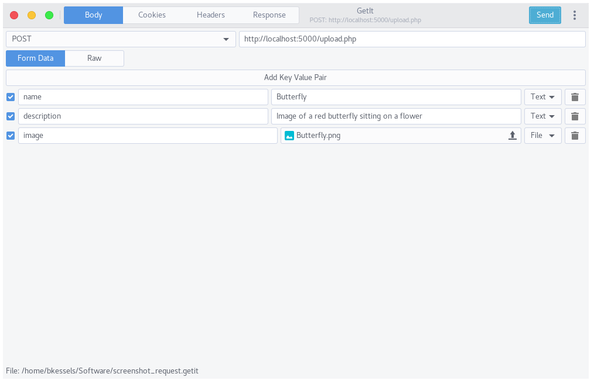
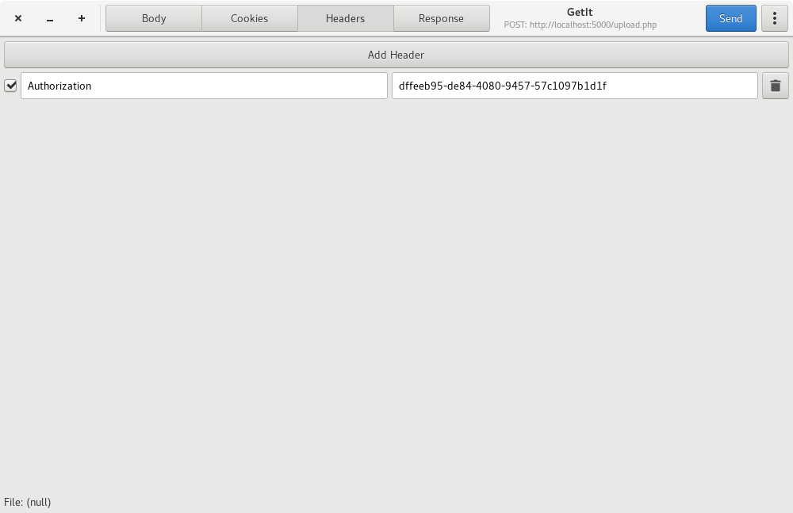
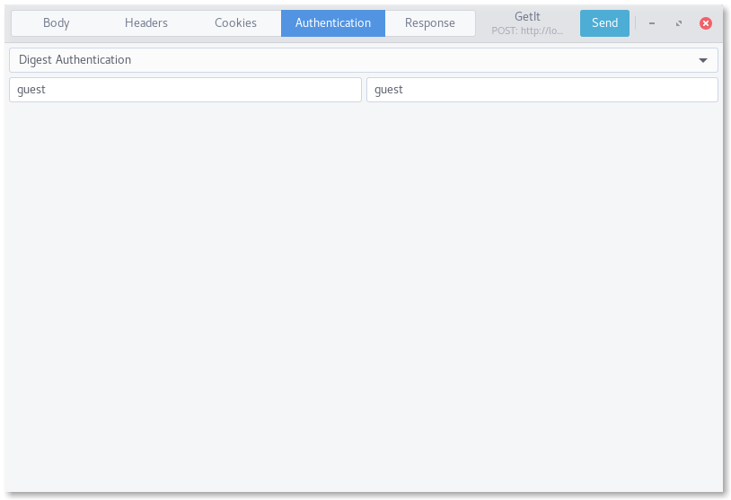
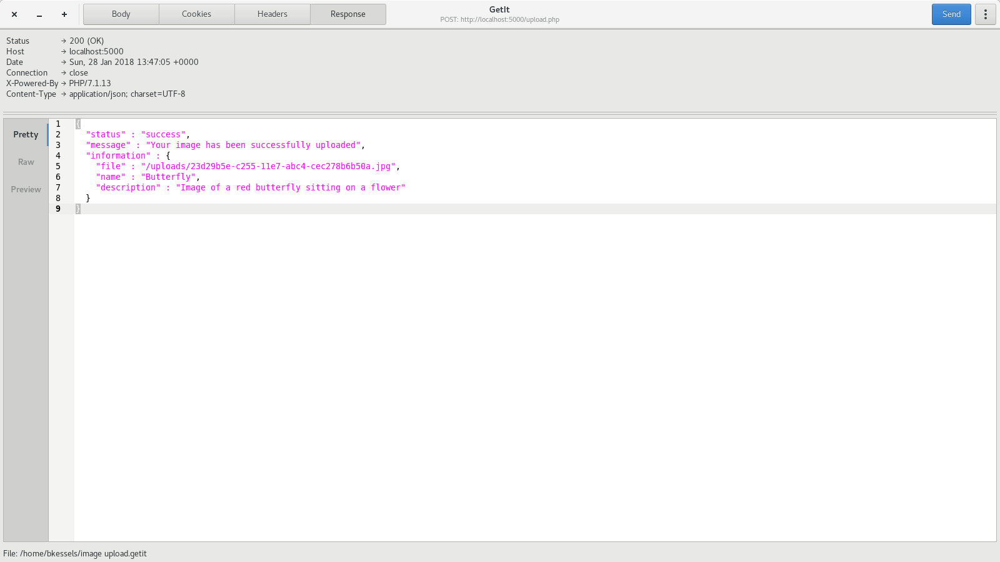

# GetIt

Application to send HTTP requests to test API's.

## Screenshots






## What can I do with it?

You can send numerous requests to a webserver. If you need it there is an
option for authentication, right now only basic auth and digest auth.

## Required packages

- gtk3-devel
- pygobject3-devel

## Features

- Add multiple form-data elements to the body
- Add multiple headers
- Use basic auth or digest auth
- Response data is displayed with syntax highlighting
- All headers from the response are shown

## How to build
```
sudo cp data/mainwindow.ui /usr/share/getit.ui
bash autogen.sh
./configure
make
```
And then run `./src/getit`

If you don't copy the mainwindow.ui file the application will crash because
it can't find the ui file.

## Generate RPM package
```
fedpkg --release f25 local
```

This will create a RPM file which you can install using your package manager.
