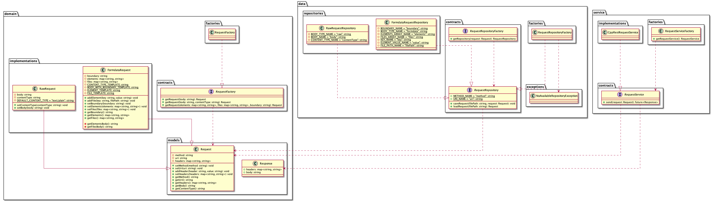

# GetIt software design

This document outlines the design philosofy for GetIt's source code.

- [1. Class diagram](#1-class-diagram)
    - [1.1 Interfaces](#11-interfaces)
    - [1.2 Classes](#12-classes)
    - [1.3 Layers](#13-layers)
- [2. Design decisions](#2-design-decisions)

## 1. Class diagram

The source code for GetIt is made up of four layers

1. [Domain](#131-domain-layer)
2. [Service](#132-service-layer)
3. [Data](#133-data-layer)
4. [Presentation](#134-presentation-layer)

Each of these layers maps to a specific namespace in which contracts, implementations and factories are defined. Besides the presentation layer, each layer must only expose data types that are either defined in the standard C++ library or use data types defined in the domain layer of GetIt itself.

To communicate with classes from a different layer a factory must be used.

### 1.1 Interfaces

As a general rule, all interfaces are defined in the contracts interface. To imply the layer the 

|__Namespace__|__Interface__|__Description__|
|---|---|---|
|`domain::contracts`|`RequestFactory`|To create a new Request, the request factory is used. But to inject the factory itself, an interface is defined which used by the dependent classes.|
|`service::contracts`|`RequestService`|To send a request, the request service is used to send the request object. But to inject the factory that instantiates the service for sending the request, an interface is used by the dependent classes.|

### 1.2 Classes

|__Namespace__|__Class__|__Description__|
|---|---|---|
|`domain::implementations`|`RawRequest`|This class is used to represent a raw http request. This implies the use of a raw body. If the body is a string, that string is directly sent to the server without any parsing beforehand.  \* This class inherits from the Request model.|
|`domain::implementations`|`FormdataRequest`|This class is used to represent a formdata http request. This implies the use of the `multipart/form-data` header. Every element or file that's added to this request is converted to the expected formdata http body, see the IETF RFC 7578 [(Adobe, 2015)](https://datatracker.ietf.org/doc/html/rfc7578#section-4). \*This class inherits from the Request model|
|`domain::factories`|`RequestFactory`|This class is used to instantiate a new Request model implementation based on the parameters. I.e. if the parameters are only applicable to a `RawRequest`, a RawRequest object is instantiated and returned.|
|`domain::models`|`Request`|This is an abstract representation of an actual request. The `getBody` and `getContentType` methods are override by implementations so these are different for the different implementations of a request.|
|`domain::models`|`Response`|This is a representation of a response returned by a server after sending a Request.|
|`service::implementations`|`CppRestRequestService`|Implementation of the RequestService that's using the CppRestRequest library from Microsoft [(Microsoft, n.d.)](https://github.com/microsoft/cpprestsdk). As of right now, this is the only implementation available for sending a request using the RequestService.|
|`service::factories`|`RequestServiceFactory`|Factory that's used to instantiate a new RequestService. Because the CppRestRequest library from Microsoft is the only supported library for sending a request this class only constructs a CppRestRequestService object. However, in the future this factory could be expanded with other request libraries.|

In the following paragraphs each layer will be explained in more detail.

### 1.3 Layers

GetIt uses the layered pattern, or N-tier pattern, to decouple the different types of partitions
most common applications consist of . This pattern groups classes by responsibility and encourages you to place
them into the same layer [(Price et Al., 2022)](https://docs.microsoft.com/en-us/azure/architecture/guide/architecture-styles/n-tier). Thus meaning that all classes and logic related to data storage or retrieval
are put into the data layer.

The table below lists and describes the different layers GetIt acknowledges.

|Layer| Description                                                                                                                                                                                                                                                                                                                                                        |
|---|--------------------------------------------------------------------------------------------------------------------------------------------------------------------------------------------------------------------------------------------------------------------------------------------------------------------------------------------------------------------|
|Domain| The domain layer consists of classes exclusive to the domain. This includes classes such as `Request` that are directly sent to a server.    The domain layer can only contain classes that are dependent on other classes inside the domain layer. This is done to prevent knowledge of anything outside of the request domain.                           |
|Service| The service layer is used to decouple the domain from the actual implementation of sending a request and retrieving a response from a server.    The service layer can be thought of as the layer that can be used to interact with domain objects. Even though it's possible to interact with the domain objects, they can't be used to send an actual request. |
|Data|The data layer is used to decouple the domain layer from storing domain objects. In the data layer it's possible to create multiple implementations of methods for saving a request, or retrieving a request.   With this decoupling, the domain layer can be used to describe the domain without worrying about any details that are required for saving a request.|
|Presentation|The presentation layer consists of QT-libraries and interaction for the GUI. The presentation layer is only allowed to communicate with the service and data layer. However, the objects from the domain layer are used as models in the MVC pattern.|

## 2. Design decisions

This paragraph describes the different decisions that were made during the design of GetIt.

|__GDD01__| Raw- and FormdataRequestBody                                                                                                    |
|---|---------------------------------------------------------------------------------------------------------------------------------|
|__Decision__| Create a different implementation for the RawRequestBody and FormdataRequestBody which implement from the RequestBody interface |
|__Motives__| When working with a Request you don't need to know the specific body type, therefore an interface `RequestBody` is used         |
|__Alternatives__| Use different Request implementations for the different body types                                                              |

|__GDD02__|Abstract factory|
|---|---|
|__Decision__|Use the abstract factory pattern to inject factories into classes|
|__Motives__|To make use of the IOC pattern, the factories are injected as interfaces as well.|

|__GDD03__|Inversion of Control (IOC)|
|---|---|
|__Decision__|Use inversion of control to communicate with dependencies|
|__Motives__|To communicate with dependencies inversion of control is used to abstract the instantation of classes away from constructors/methods that are dependent on the implementations.|

|__GDD04__|Constructor injection|
|---|---|
|__Decision__|Dependency injection is implemented with constructor injection|
|__Motives__|By using constructor injection the dependencies need to be built in the `main.cpp` file instead of relaying on the complexity of a dependency injection framework.   However, in the future a DI framework might be implemented without changing the underlying code of GetIt if the DI framework supports constructor injection.|

|__GDD05__|Construct classes using a factory|
|---|---|
|__Decision__|Only construct new objects using a factory|
|__Motives__|To keep the construction of new classes in a single place, factories are used to construct new instances of objects.  However, some exceptions are expected. But these exceptions only remain in the convert classes or the `main` method. If objects are instantiated outside of a factory, it must be explicitly expressed in a comment.|