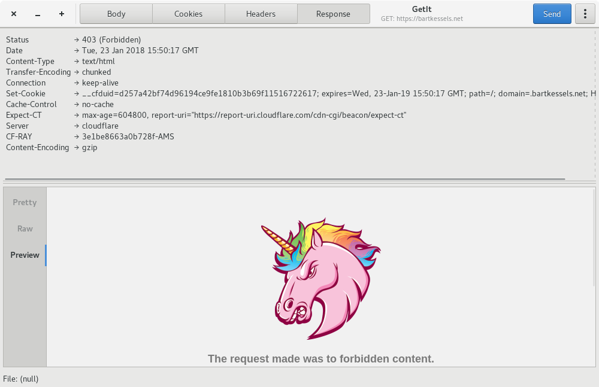

# GetIt

Application to send HTTP requests to test your API endpoints.

## Screenshots




## What can I do with it?

You can send numerous requests to a webserver. You can send RAW post data, 
form post data, add cookies to your request and add headers to your request.

The response can be viewed either as syntax highlighted code, with JSON even
being made readable, as the raw output, which means no syntax highlighting, and
view it in a webview.

## Required packages

### Building
- gcc
- meson
- gtk3-devel
- gtksourceview3-devel
- json-glib-devel
- glib-devel
- libsoup-devel
- libnotify-devel
- gettext
- webkitgtk4-devel

### Installing
- gtk3
- gtksourceview3
- json-glib
- glib
- libsoup
- libnotify
- webkitgtk4

## Features

- Add multiple form-data elements to the body
- Add custom data to the body
- Add files to a request
- Add cookies to a request
- Add multiple headers
- Set timeout for request
- Set user agent for request
- Keep track of recent requests
- Response data is displayed with syntax highlighting
- All headers from the response are shown
- Save a request
- Open a request

[GetIt features playlist](https://www.youtube.com/playlist?list=PLP-QZD6Cd0MWh7969cLZg31gO71s44Bk4)

## How to build

```
$ meson --prefix=/usr build
$ cd build
$ ninja install
```
And then run `getit`

## Generate RPM package

```
$ cd data/packaging/RPM
$ spectool -g getit.spec
$ fedpkg --release f26 local
```

This will create a RPM file which you can install using your package manager.

## Generate flatpak bundle

```
$ cd data/packaging/flatpak
$ flatpak-builder --repo=getit_repo getit net.bartkessels.getit.json
$ flatpak build-bundle getit_repo getit.flatpak net.bartkessels.getit
```

This will create a flatpak bundle called `getit.flatpak`. To install the flatpak bundle
just run the flatpak install command.

```
$ flatpak install getit.flatpak
```

## COPR

If you have Fedora and don't want to build GetIt from source you can easily install it using dnf copr.

```
$ dnf copr enable bartkessels/getit
$ dnf install getit
```

