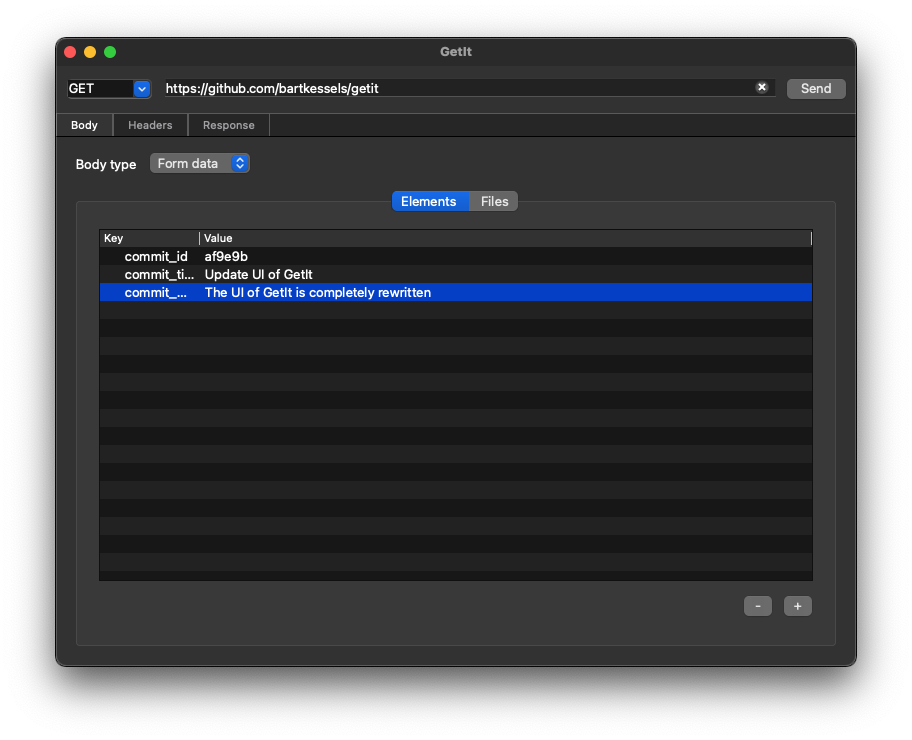

# GetIt

Open Source HTTP client to test your API's.

[](https://opensource.org/licenses/MIT)
<br>
[](https://github.com/bartkessels/GetIt/actions/workflows/build_and_test.yml)
[](https://www.codacy.com/gh/bartkessels/GetIt/dashboard?utm_source=github.com&amp;utm_medium=referral&amp;utm_content=bartkessels/GetIt&amp;utm_campaign=Badge_Grade)
[](https://github.com/bartkessels/GetIt/actions/workflows/codeql-analysis.yml)
<br>
<!-- Build status -->
[](https://github.com/bartkessels/GetIt/actions/workflows/macos_bundle.yml)
[](https://github.com/bartkessels/GetIt/actions/workflows/windows_executable.yml)
[](https://github.com/bartkessels/GetIt/actions/workflows/linux_flatpak.yml)

---

Welcome to the Git repository of GetIt. GetIt is a small open source application to send API
request using a cross-platform GUI. The main advantage of GetIt is the fact that it's native, no
matter what platform you use, and it's completely open source.

# Table of contents

- [1. Overview](#1-overview)
  - [1.1 Sharing requests](#11-sharing-requests)
  - [1.2 Roadmap](#12-roadmap)
- [2. External dependencies](#2-external-dependencies)
- [3. Build](#3-build)
  - [3.1 MacOS](#31-macos)
  - [3.2 Linux](#32-linux)
  - [3.3 Windows](#33-windows)
- [4. Package](#4-package)
  - [4.1 MacOS](#41-macos)
  - [4.2 Linux](#42-linux)
  - [4.3 Windows](#43-windows)
- [5. Automated testing](#5-automated-testing)
- [6. Contribute](#6-contribute)
  - [6.1 Branching strategy](#61-branching-strategy)

# 1. Overview

GetIt's main focus is providing an easy user interface to send HTTP request to your API endpoints.
GetIt is developed for developers who'd like a native application which is capable of saving requests
in a modern file format.



## 1.1 Sharing requests

GetIt uses the JSON-format to store request information, however, when you've got a request that uses
files these files aren't incorporated into the GetIt request file.

The main features of GetIt compared to the alternatives are the way requests can be shared. There are
other applications which let's you synchronise a number of requests using a proprietary cloud solution 
with a subscription. In the design of GetIt we took the sharing of requests very seriously but since we're not
an entire company we can't setup an entire cloud solution. Thus we've made sure the file contents are human readable
an easy to check-in using VCS.

## 1.2 Roadmap

Because GetIt is maintained in the spare time, not all features that we'd like are implemented as of yet.
Some of the features we'd like to see in GetIt are listed below. These features are also added as issues
on GitHub so the status can be viewed in the projects tab.

- Multiple authentication flows
  - OAuth
  - JWT
  - Basic Auth
- Environment variables
  - Variables that are stored in the request itself
  - Variables that are stored in the settings of GetIt
    - To allow API secrets to be stored, but not checked into VCS
- Automated stress testing

# 2. External dependencies

GetIt uses CMake to download and compile most of it's dependencies. However, not all dependencies
are aviable through this method so these need to be installed on the machine itself before compiling.
When downloading and executing a pre-built release from the Releases tab on Github, these dependencies
aren't required.

- [Qt](https://qt.io)
  - The GUI framework used by GetIt
- [Boost](https://boost.org)
  - Helper libraries for formatting strings and used by [CppRestSdk](https://github.com/microsoft/cpprestsdk), which in turn is used by GetIt as the HTTP library
- [Ninja](https://ninja-build.org)
  - Cross-platform build system
- [CMake](https://cmake.org)
  - Cross-platform build tool generator

If you set the `use_installed_dependencies` flag to `true` when running the `cmake` command, you also need the following dependencies. __Note that this is NOT required by default__.

- [CppRestSDK](https://github.com/microsoft/cpprestsdk)
  - The library used to make HTTP calls
- [Niels Lohmann Json](https://github.com/nlohmann/json)
  - The library used to endcode and decode json strings

# 3. Build

## 3.1 MacOS

The following variables can be set through the `-D<variable>=` flag for the `cmake` command.

* `use_qt6`
  * If you've got Qt6 installed, use this flag to force the use of Qt6. Otherwise CMake will try to locate Qt5.
* `use_installed_dependencies`
  * If you've got all GetIt dependencies installed, set this variable to `true` to make sure that CMake won't download the dependencies. The default value is `false`.
* `CMAKE_CXX_FLAGS`
  * When you're getting a lot of warnings but they're not neccessary ignore them with `-DCMAKE_CXX_FLAGS="-w"`, or enable them all with `-DCMAKE_CXX_FLAGS="-Wall"`

```bash
# Disable warnings as error, these warning are from the CppRestSdk dependency
$ cmake . -G Ninja -D CMAKE_CXX_FLAGS="-w"
$ ninja GetIt
```

This will create the `./bin/GetIt.app` file. This can be executed by double-clicking it in Finder.

Please note that this app bundle does __NOT__ include the dependencies or the Qt framework. When you move
the bundle to a different location on your computer (or another computer altogether) the application might not start.

## 3.2 Linux

The following variables can be set through the `-D<variable>=` flag for the `cmake` command.

* `use_qt6`
  * If you've got Qt6 installed, use this flag to force the use of Qt6. Otherwise CMake will try to locate Qt5.
* `use_installed_dependencies`
  * If you've got all GetIt dependencies installed, set this variable to `true` to make sure that CMake won't download the dependencies. The default value is `false`.
* `CMAKE_CXX_FLAGS`
  * When you're getting a lot of warnings but they're not neccessary ignore them with `-DCMAKE_CXX_FLAGS="-w"`, or enable them all with `-DCMAKE_CXX_FLAGS="-Wall"`

```bash
$ cmake . -G Ninja
$ ninja GetIt
```

This will create the `./bin/GetIt` binary file. It can be executed by either running `./bin/GetIt` from the terminal
or double-clicking the file through your file browser.

## 3.3 Windows

The following variables can be set through the `-D<variable>=` flag for the `cmake` command.

* `use_qt6`
  * If you've got Qt6 installed, use this flag to force the use of Qt6. Otherwise CMake will try to locate Qt5.
* `use_installed_dependencies`
  * If you've got all GetIt dependencies installed, set this variable to `true` to make sure that CMake won't download the dependencies. The default value is `false`.
* `CMAKE_PREFIX_PATH`
  * If CMake can't find the Qt libraries add the location of the Qt directory to this property: `-DCMAKE_PREFIX_PATH=C:\Qt5` 
* `CMAKE_TOOLCHAIN_FILE`
  * When using VCPKG to install dependencies like Boost, use this flag to tell CMake where to locate these packkages: `-DCMAKE_TOOLCHAIN_FILE=C:\\vcpkg\\scripts\\buildsystems\\vcpkg.cmake`
* `CMAKE_CXX_FLAGS`
  * When you're getting a lot of warnings but they're not neccessary ignore them with `-DCMAKE_CXX_FLAGS="-w"`, or enable them all with `-DCMAKE_CXX_FLAGS="-Wall"`
* `VCPKG_TARGET_TRIPLET`
  * This is to tell what target is used by VCPKG, set it to `-DVCPKG_TARGET_TRIPLET="x64-windows-static"`
* `Boost_INCLUDE_DIR`
  * When you're getting the message that the `Boost_INCLUDE_DIR` isn't set, set it to `-DBoost_INCLUDE_DIR="C:\\vcpk\\installed\\x64-windows-static\\include"`
* `OPENSSL_INCLUDE_DIR`
  * When you're getting the message that the `OPENSSL_INCLUDE_DIR` isn't set, set it to `-DOPENSSL_INCLUDE_DIR="C:\\vcpk\\installed\\x64-windows-static\\include"`

```powershell
C:\GetIt> cmake . -G `"Visual Studio 17 2022`"
C:\GetIt> msbuild GetIt.sln -property:Configuration=Release
```

This will create the `./bin/GetIt.exe` executable. It can be executed by double-clicking the file from Explorer.

Please note that this app bundle does __NOT__ include the dependencies or the Qt framework. When you move
the executable to a different location on your computer (or another computer altogether) the application might not start.

# 4. Package

## 4.1 MacOS

Build the MacOS app bundle with all dependencies and framework included by running the `package.sh` script
in the MacOS packaging folder.

Please refer to the building section of MacOS when you're getting an error message.

```bash
# Create the project files
$ cmake . -G Ninja -Dpackaging=true

# Generate the MacOS Bundle
$ ninja GetIt

# Copy the icon of GetIt to the app bundle
$ cp ./packaging/macos/icons/getit.icns ./bin/GetIt.app/Contents/Resources
```

This will create the `./bin/GetIt.app` app bundle with all required dependencies. This file can be distributed across
multiple systems.

## 4.2 Linux

Build the flatpak bundle by running the following commands. This create the flatpak bundle that
you can run if you have the flatpak runtime installed.

Please refer to the building section of Linux when you're getting an error message.

```bash
# Prepare the flatpak template
$ cmake . -G Ninja -Dpackaging=true

# Create the flatpak repository for our bundle
$ flatpak-builder --repo=getit_repo getit ./packaging/linux/getit.yml

# Create the bundle itself
$ flatpak build-bundle getit_repo getit.flatpak net.bartkessels.getit
```

## 4.3 Windows

Build the Windows executable by running the following commands. This will build GetIt and add all the required 
dependencies in the executable. Please refer to the building section of Windows when you're getting error messages.

```powershell
C:\GetIt> cmake . -G `"Visual Studio 17 2022`" -Dpackaging=true
C:\GetIt> msbuild GetIt.sln -property:Configuration=Release

# Add the Qt dependencies to the executable
C:\GetIt> windeployqt bin\GetIt.exe
```

# 5. Automated testing

To validate that GetIt works, and keeps working through various updates GetIt includes automated unit
tests using [Catch2](https://github.com/catch/catch2). These tests are automatically executed when you create
a PR or when directly pushing to the main branch (which should __NEVER__ be done!).

To execute these tests manually you need to specify the `getit_tests` build target.

```bash
$ cmake . -G Ninja
$ ninja getit_tests

# Execute the test cases
$ ./bin/getit_tests
```

This will generate an application that will test GetIt when executed.

# 6. Contribute

If there's a feature you'd like to see, or a bug you've encountered? Please let us know! Or, even better, fix it
yourself! If you'd just like to contribute back to GetIt but you're not quite sure how to help, take a look at the roadmap
for features we'd love to see in GetIt.

All contributions are welcome, so feel free to join the open source community and support GetIt through your expertise!

To make sure everyone can contribute to GetIt we value the quality and understandability of our code. When you're building
a feature, or patching a bug and you've made a decision. Please document this decision in the [`docs/design.md`](docs/design.md) document.
This will help future contributors understand your rationale. If you've updated some logic in the code, please always update related
test cases or add test cases to test your logic.

## 6.1 Branching strategy

You've got your idea to help us out, but you're not quite sure how to setup your branch. We'll we've got you covered!

This project does not use a development branch but uses short lived feature branches which are directly merged into `main`.
We've chosen this strategy 'cause we believe in _release often, release fast_, there's no need for your feature to gather dust in
a stale development branch. However we do have some guidelines:

- If you're contributing a __feature__ use the `feature/<your-feature>` naming convention
- If you're contributing a __bug fix__ use the `bugfix/<bug-name>` naming convention
- If you're contributing to __documentation__ use the `documentation/<type-of-documentation>` naming convention
- If you're contributing a __small fix__, like a version bump to a dependency, use the `hotfix/<hotfix-type>-<name>` naming convention
